# Brain Tumor 3-Way Image Classifier

## Project Overview
In this deep learning project, we developed a robust system to classify brain MRI scans into four categories: glioma tumor, meningioma tumor, pituitary tumor, or no tumor. Addressing the challenge of class imbalance, we employed the undersampling technique. Additionally, we enhanced our dataset through data augmentation techniques, including rotation, width shifting, height shifting, shearing, zooming, and horizontal flipping.

## Images Visualization

<b>Five Random Images from each Class</b>

  

## Methodologies Applied
We adopted three distinct approaches for image classification and compared their performance on our dataset.

### First Approach: CNN
Multi-Layer Convolutional Neural Network (CNN): Our initial model was based on a multi-layer CNN architecture, consisting of convolutional, pooling, and fully connected layers. These layers enabled the model to detect and learn intricate patterns in MRI images. We used Dropout regularization to mitigate overfitting. The model progressively captured low-level features like edges and textures, which were then combined into high-level features representing different tumor types. Before training, we used Keras-Tuner to optimize the hyperparameters.

#### Results Analysis

  

  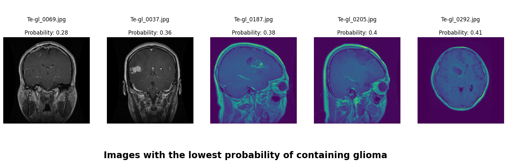

  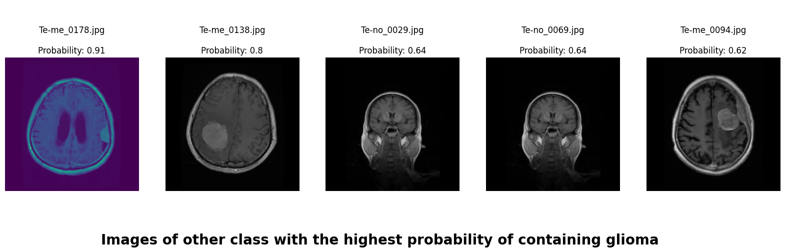

  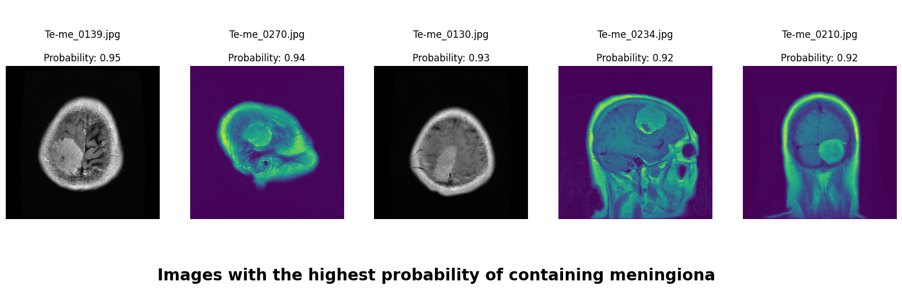

  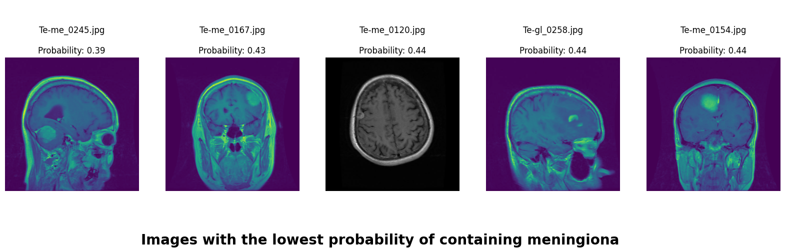

  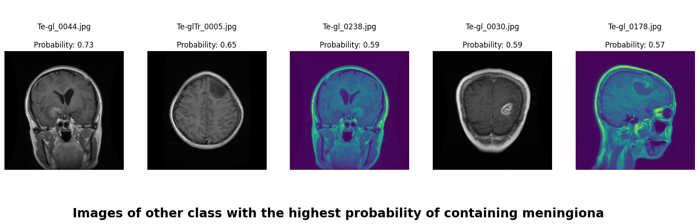

  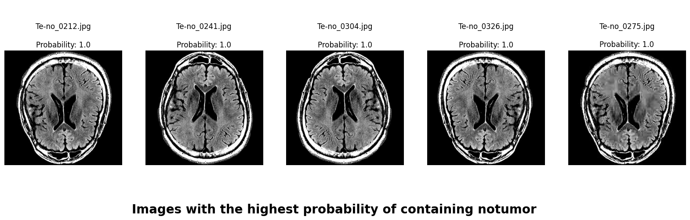

  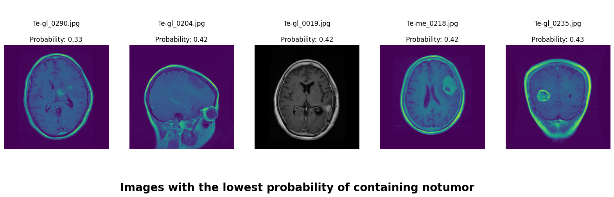

  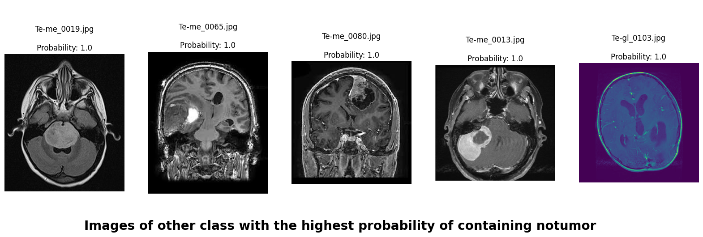

  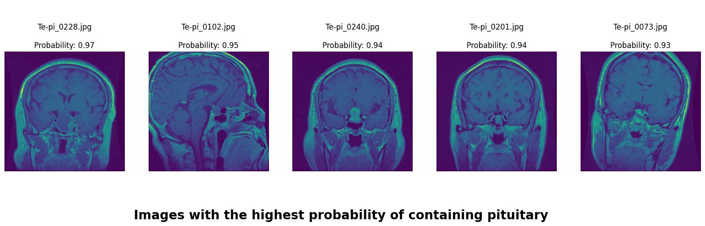

  

  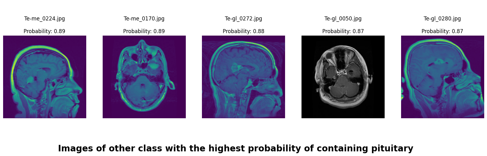

### Second Approach: AutoKeras:
We used AutoKeras to explore and evaluate two different model architectures to find the best one.

### Third Approach: Transfer Learning
We employed transfer learning, a technique where a pre-trained model is used as the starting point for a new task. This method leverages the knowledge gained from large datasets to enhance the learning process on smaller, task-specific datasets.

InceptionV3, originally developed by Google for the ImageNet competition, is a deep convolutional neural network that features inception modules. Inception modules work by employing multiple convolution filters of different sizes simultaneously to capture features at multiple scales within the same layer. These modules capture multi-scale features (low level to high level) through parallel convolutional operations of different sizes, making the model highly effective at recognizing complex patterns.

- Second Model: Feature Extraction with InceptionV3: We used the pre-trained weights from InceptionV3 to extract high-level features from the MRI images. This approach leverages the general image recognition capabilities of InceptionV3 to improve classification accuracy without training a model from scratch.

- Third Model: Fine-Tuning InceptionV3: In this model, we fine-tuned InceptionV3 by adjusting and retraining its deeper layers on our specific dataset. This allowed the model to adapt more closely to the nuances of our MRI images, enhancing its performance in distinguishing between different types of tumors and no tumor.

## Models Comparison

<b>Comparison of the Three Models</b>

  

## Class Application Map
We applied a Class Activation Map (CAM) to one of the training images to understand how all the three models make predictions. This visualization technique highlights the areas in the image that are most influential in the model's decision-making process. By overlaying the CAM on the original image, we can better interpret which regions of the image contribute to the model’s classification.

  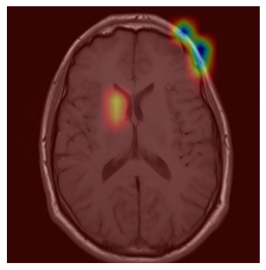
  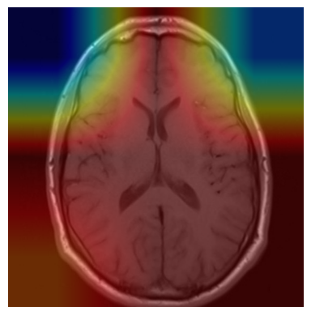 
  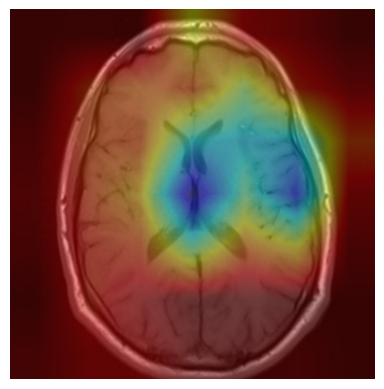

## Data Source
https://www.kaggle.com/datasets/masoudnickparvar/brain-tumor-mri-dataset

## License
This project is licensed under the Raza Mehar License. See the LICENSE.md file for details.

## Contact
For any questions or clarifications, please contact Raza Mehar at [raza.mehar@gmail.com], Pujan Thapa at [iampujan@outlook.com] or Syed Najam Mehdi at [najam.electrical.ned@gmail.com].
